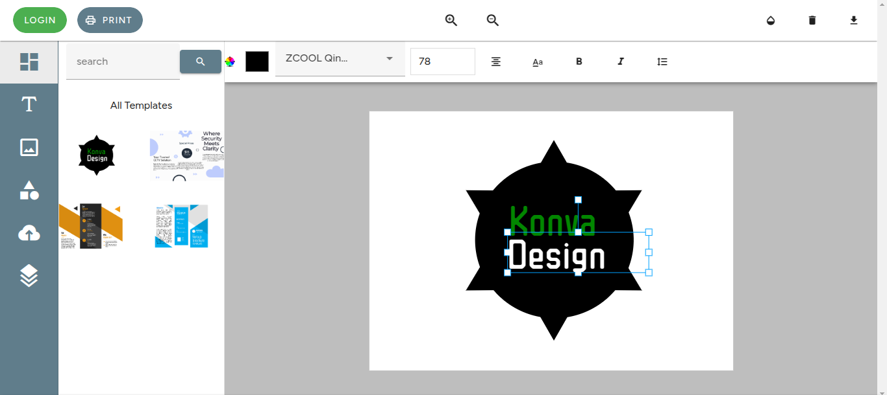
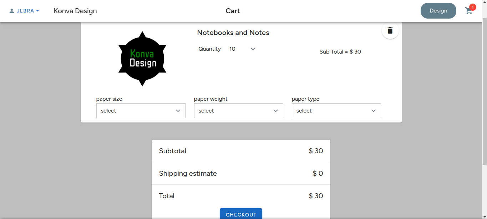
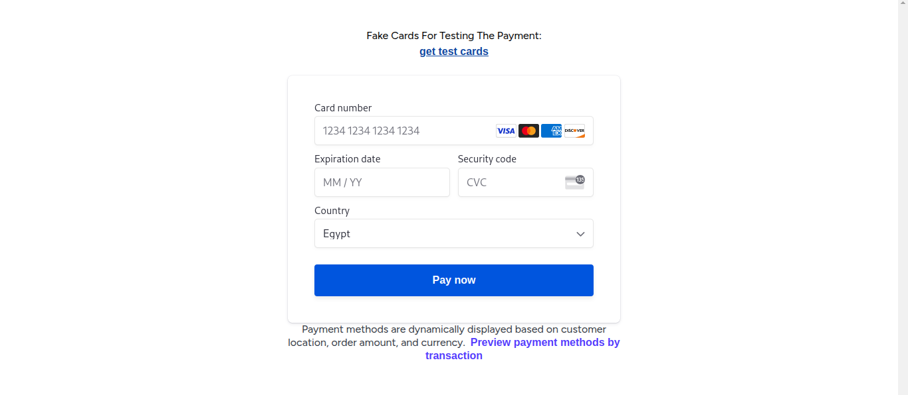
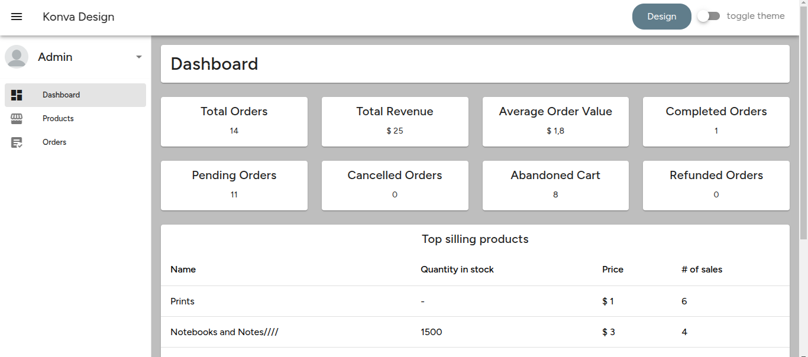
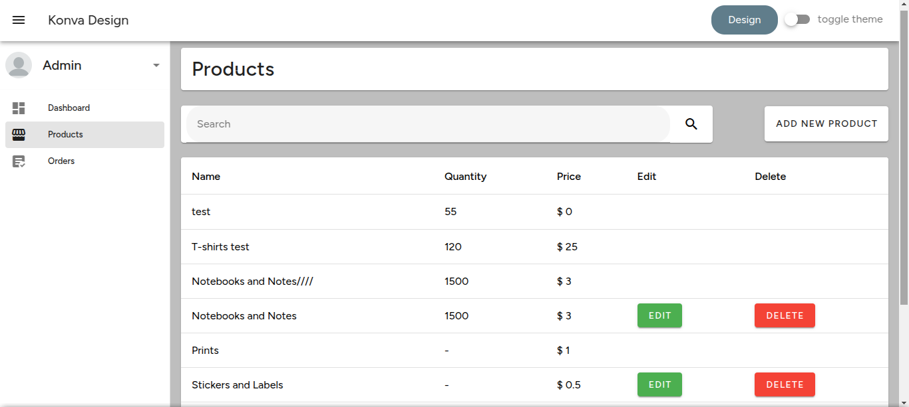
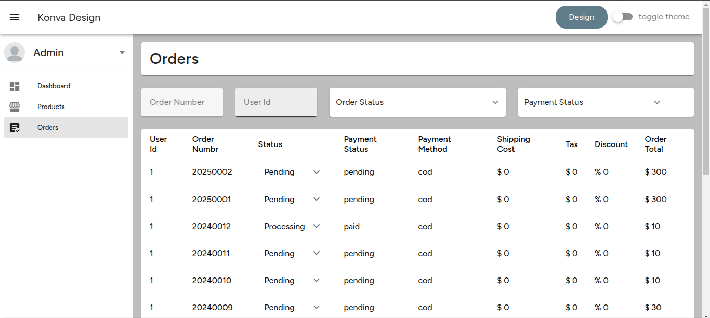

## Konva Design

Developed a single-page application (SPA) for designing personalized items with customizable
options, such as paper type, print styles, and more. Integrated third-party APIs, including Google
Authentication for user sign-in, and Stripe for payment processing.
Built an admin panel to streamline system management.

## Prerequisites

- **Node.js**
- **npm or yarn**
- **PHP**
- **Composer**
- **MySQL**

## Screenshots

### Admin Dashboard

